Xamarin.Forms with Prism
===========================================

This article is all about using Prism in a Xamarin.Forms application. It'll show you how easy it is to create a Xamarin.Forms application when using Prism. 


Prism
======
Prism is defined as "a framework for building loosely coupled, maintainable, and testable XAML apps. It provides an implementation of a collection of design patterns that are helpful in writing well-structured and maintainable XAML apps. It includes MVVM, dependency injection, commands, EventAggregator, EventToCommand and many others."

In simple words, Prism helps us write better code.

Prerequisites
==============
* Visual Studio 2017 or higher
* Prism Template Pack (Visual Studio Extensions)
* Basic knowledge about XAML, MVVM, design patterns.

Install Prism Template
======================
Open VisualStudio and click on the Extensions --> Manage Extensions. In the left pane, choose "Online" and search for the "Prism Template Pack". Click Download and close the widget and all instance of the VisualStudio for the template to get installed. 

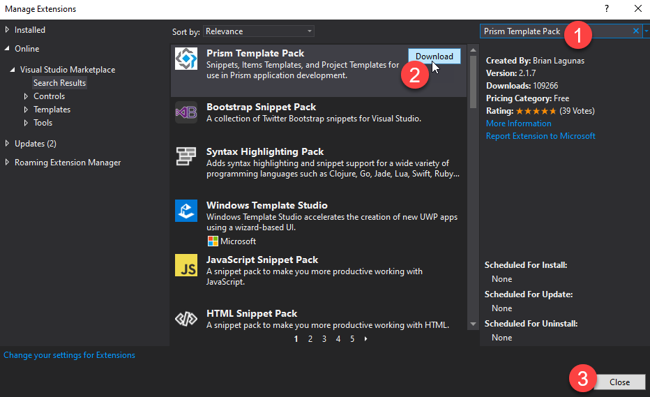

Create Project
===============
Open VisualStudio and click on "Create a new project". 

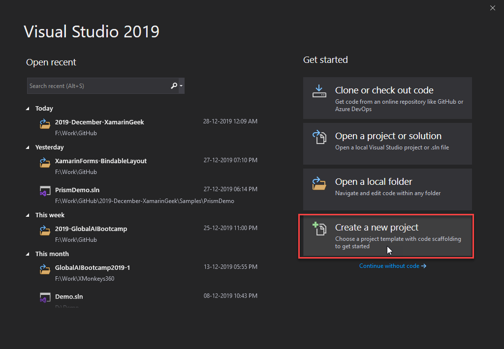

Choose "Prism Blank App" and click Next. 

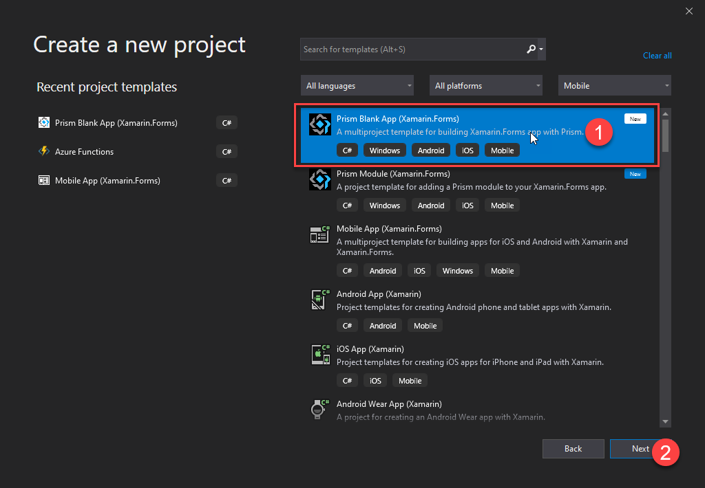

Enter Project name, choose a desired location to save the project and click Create. In the "PRISM PROJECT WIZARD", select the required platforms, choose the desired Container and click "CREATE PROJECT". 

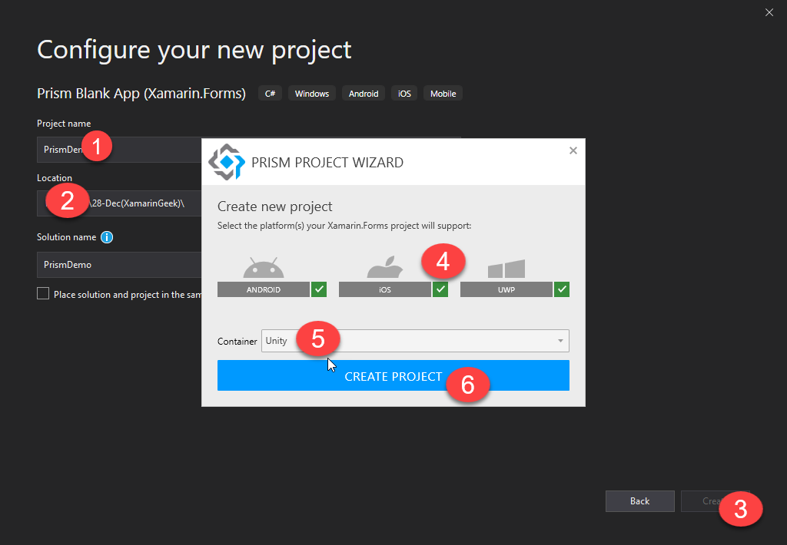

The prism project is created and the structure of the project would be like below. 

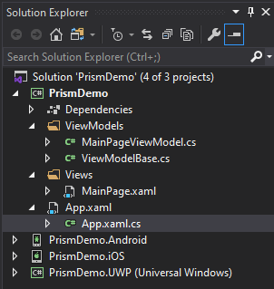

Update the Xamarin.Forms NuGet package to any version greater than 4.2.~. Click run by setting every project as startup project and see the output. 

Let's start coding
===================
Create a new folder "Models" and add a new file called "PlatformInfo.cs" and add the below code. Make sure to add the namespace "using System.ComponentModel" at the top. 

```c#
public class PlatformInfo : INotifyPropertyChanged
{
    private bool _isChecked;
    private string _platformName;

    public bool IsChecked
    {
        get { return _isChecked; }
        set { _isChecked = value; NotifyPropertyChanged(); }
    }

    public string PlatformName
    {
        get { return _platformName; }
        set { _platformName = value; NotifyPropertyChanged(); }
    }

    public event PropertyChangedEventHandler PropertyChanged;
    public void NotifyPropertyChanged([System.Runtime.CompilerServices.CallerMemberName] string propertyName = "")
    {
        if (this.PropertyChanged != null)
            this.PropertyChanged(this, new PropertyChangedEventArgs(propertyName));
    }
}
```

Open the MainPageViewModel and configure the below code. 

```c#
public class MainPageViewModel : ViewModelBase
{
    private List<PlatformInfo> _platformList;

    public List<PlatformInfo> PlatformsList
    {
        get { return _platformList; }
        set { SetProperty(ref _platformList, value); }
    }
    public MainPageViewModel(INavigationService navigationService) : base(navigationService)
    {
        Title = "Main Page";
    }

    public override void OnNavigatedTo(INavigationParameters parameters)
    {
        base.OnNavigatedTo(parameters);
        this.GetContactsList();
    }

    private void GetContactsList()
    {
        if (this.PlatformsList == null)
            this.PlatformsList = new List<PlatformInfo>();

        this.PlatformsList.Add(new PlatformInfo() { IsChecked = true, PlatformName = "Android" });
        this.PlatformsList.Add(new PlatformInfo() { IsChecked = true, PlatformName = "iOS" });
        this.PlatformsList.Add(new PlatformInfo() { IsChecked = false, PlatformName = "UWP" });
    }
}
```

Open the MainPage.xaml and write the below code. 

```xaml
<?xml version="1.0" encoding="utf-8" ?>
<ContentPage xmlns="http://xamarin.com/schemas/2014/forms"
             xmlns:x="http://schemas.microsoft.com/winfx/2009/xaml"
             xmlns:prism="clr-namespace:Prism.Mvvm;assembly=Prism.Forms"
             prism:ViewModelLocator.AutowireViewModel="True"
             x:Class="PrismDemo.Views.MainPage"
             Title="{Binding Title}">

    <ListView x:Name="contactList" ItemsSource="{Binding PlatformsList}" SelectionMode="None"
              SeparatorColor="LightGray" SeparatorVisibility="Default">
        <ListView.ItemTemplate>
            <DataTemplate>
                <ViewCell>
                    <StackLayout Orientation="Horizontal">
                        <CheckBox IsChecked="{Binding IsChecked}" VerticalOptions="Center" />
                        <Label TextColor="Black" Margin="10,0" Text="{Binding PlatformName}" VerticalOptions="Center">
                            <Label.Triggers>
                                <DataTrigger TargetType="Label" Binding="{Binding IsChecked}" Value="true">
                                    <Setter Property="TextColor" Value="Black"/>
                                </DataTrigger>
                                <DataTrigger TargetType="Label" Binding="{Binding IsChecked}" Value="false">
                                    <Setter Property="TextColor" Value="DarkGray"/>
                                </DataTrigger>
                            </Label.Triggers>
                        </Label>
                    </StackLayout>
                </ViewCell>
            </DataTemplate>
        </ListView.ItemTemplate>
    </ListView>
</ContentPage>
```

Click the run button and see the below output. 

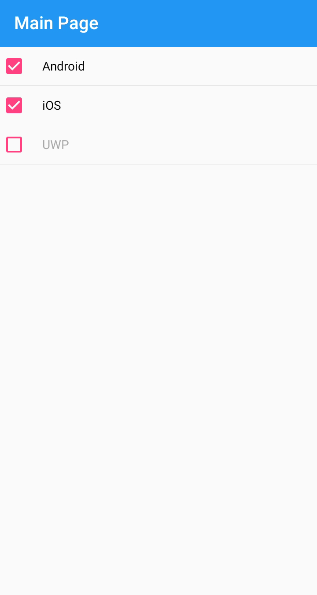

Let us create few new pages so that when tapping on the list items we can navigate to the corresponding pages. First let us create a new page called "AndroidPage" as shown below. 

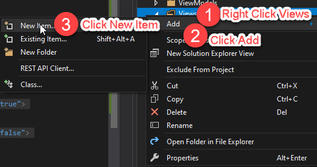

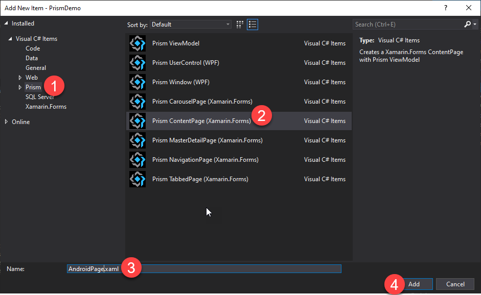

Note that the "AndroidPageViewModel.cs" is automatically created by the Prism framework. Now let's add some code in the created files. 

Add the below code in the ViewModelBase.cs.

```c#
...
private PlatformInfo _platformInformation;
public PlatformInfo PlatformInformation
{
    get { return _platformInformation; }
    set { SetProperty(ref _platformInformation, value); }
}
...
```

Write the below code in the AndroidPage.xaml. 
```xaml
<?xml version="1.0" encoding="utf-8" ?>
<ContentPage xmlns="http://xamarin.com/schemas/2014/forms"
             xmlns:x="http://schemas.microsoft.com/winfx/2009/xaml"
             xmlns:prism="http://prismlibrary.com"
             prism:ViewModelLocator.AutowireViewModel="True"
             x:Class="PrismDemo.Views.AndroidPage"
             Title="{Binding Title}">

    <Frame>
        <StackLayout>
            <Label Text="{Binding PlatformInformation.PlatformName}" FontSize="Large" HorizontalTextAlignment="Center"/>
            <BoxView Color="LightGray" HeightRequest="0.5"/>
            <WebView Source="https://docs.microsoft.com/en-us/xamarin/android/" VerticalOptions="FillAndExpand" HorizontalOptions="FillAndExpand" />
        </StackLayout>
    </Frame>
</ContentPage>
```

Write the below code in the AndroidPageViewModel.cs file. 
```c#
using Prism.Navigation;
using PrismDemo.Models;

namespace PrismDemo.ViewModels
{
    public class AndroidPageViewModel : ViewModelBase
    {
        public AndroidPageViewModel(INavigationService navigationService) : base(navigationService)
        {
            Title = "Android Page";
        }

        public override void OnNavigatedTo(INavigationParameters parameters)
        {
            PlatformInformation = (PlatformInfo)parameters["platformInfo"];
            base.OnNavigatedTo(parameters);
        }
    }
}
```

Note that the "AndroidPage" is receiving the "PlatformInfo" of the tapped item in the ListView as parameter.

Similarly create new pages "iOSPage" and "UWPPage" so that the "iOSViewModel" and "UWPViewModel" will be automatically generated by the Prism framework. Configure the below codes in that file. 

```xaml
<!--iOSPage.xaml-->
<?xml version="1.0" encoding="utf-8" ?>
<ContentPage xmlns="http://xamarin.com/schemas/2014/forms"
             xmlns:x="http://schemas.microsoft.com/winfx/2009/xaml"
             xmlns:prism="http://prismlibrary.com"
             prism:ViewModelLocator.AutowireViewModel="True"
             x:Class="PrismDemo.Views.iOSPage"
             Title="{Binding Title}">

    <Frame>
        <StackLayout>
            <Label Text="{Binding PlatformInformation.PlatformName}" FontSize="Large" HorizontalTextAlignment="Center"/>
            <BoxView Color="LightGray" HeightRequest="0.5"/>
            <WebView Source="https://docs.microsoft.com/en-us/xamarin/ios/" VerticalOptions="FillAndExpand" HorizontalOptions="FillAndExpand" />
        </StackLayout>
    </Frame>
</ContentPage>
```

```c#
//iOSViewModel.cs
using Prism.Navigation;
using PrismDemo.Models;

namespace PrismDemo.ViewModels
{
    public class iOSPageViewModel : ViewModelBase
    {
        public iOSPageViewModel(INavigationService navigationService) : base(navigationService)
        {
            Title = "iOS Page";
        }

        public override void OnNavigatedTo(INavigationParameters parameters)
        {
            PlatformInformation = (PlatformInfo)parameters["platformInfo"];
            base.OnNavigatedTo(parameters);
        }
    }
}
```

```xaml
<!--UWPPage.xaml-->
<?xml version="1.0" encoding="utf-8" ?>
<ContentPage xmlns="http://xamarin.com/schemas/2014/forms"
             xmlns:x="http://schemas.microsoft.com/winfx/2009/xaml"
             xmlns:prism="http://prismlibrary.com"
             prism:ViewModelLocator.AutowireViewModel="True"
             x:Class="PrismDemo.Views.UWPPage"
             Title="{Binding Title}">

    <Frame>
        <StackLayout>
            <Label Text="{Binding PlatformInformation.PlatformName}" FontSize="Large" HorizontalTextAlignment="Center"/>
            <BoxView Color="LightGray" HeightRequest="0.5"/>
            <WebView Source="https://docs.microsoft.com/en-us/uwp" VerticalOptions="FillAndExpand" HorizontalOptions="FillAndExpand" />
        </StackLayout>
    </Frame>
</ContentPage>
```

```c#
//UWPViewModel.cs
using Prism.Navigation;
using PrismDemo.Models;

namespace PrismDemo.ViewModels
{
    public class UWPPageViewModel : ViewModelBase
    {
        public UWPPageViewModel(INavigationService navigationService) : base(navigationService)
        {
            Title = "UWP Page";
        }

        public override void OnNavigatedTo(INavigationParameters parameters)
        {
            PlatformInformation = (PlatformInfo)parameters["platformInfo"];
            base.OnNavigatedTo(parameters);
        }
    }
}
```
We have now configured the required files. Lets start with the view models registrations to add more functionality. 

Registering
============
Open the App.xaml.cs file. You could see that the registerations are automatically done by the Prism framework. If you want to add any services like "APIServices" you can register them as well here to use it across the application. 

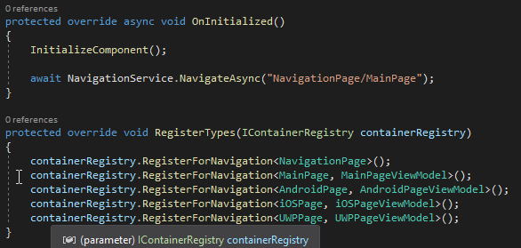

Let's configure the ItemTapped event for the ListView so that we can navigate to the created pages respectively upon tapping on each item.

Since, we are creating a MVVM sample, it is not correct to add code behind code to configure the navigation. Hence Prism framework provides a way to fire events from the ViewModel using the EventToCommandBehavior.

DelegateCommand and EventToCommandBehavior
============================================
Open the "MainPageViewModel.cs" and configure the below code. 

```c#
public DelegateCommand<PlatformInfo> NavigateToPlatformCommand { get; set; }

public MainPageViewModel(INavigationService navigationService) : base(navigationService)
{
    Title = "Main Page";
    NavigateToPlatformCommand = new DelegateCommand<PlatformInfo>(OnNavigateToPlatform);
}

private async void OnNavigateToPlatform(PlatformInfo platformInfo)
{
    
}
```

Open the "MainPage.xaml" and write the below code. 

```xaml
<?xml version="1.0" encoding="utf-8" ?>
<ContentPage xmlns="http://xamarin.com/schemas/2014/forms"
             xmlns:x="http://schemas.microsoft.com/winfx/2009/xaml"
             xmlns:prism="clr-namespace:Prism.Mvvm;assembly=Prism.Forms"
             prism:ViewModelLocator.AutowireViewModel="True"
             xmlns:b="clr-namespace:Prism.Behaviors;assembly=Prism.Forms"
             x:Class="PrismDemo.Views.MainPage"
             Title="{Binding Title}">

    <ListView x:Name="contactList" ItemsSource="{Binding PlatformsList}" SelectionMode="None"
              SeparatorColor="LightGray" SeparatorVisibility="Default">
        <ListView.Behaviors>
            <b:EventToCommandBehavior EventName="ItemTapped" 
                                      Command="{Binding NavigateToPlatformCommand}"
                                      EventArgsParameterPath="Item" />
        </ListView.Behaviors>
        <ListView.ItemTemplate>
            <DataTemplate>
                <ViewCell>
                    <StackLayout Orientation="Horizontal">
                        <CheckBox IsChecked="{Binding IsChecked}" VerticalOptions="Center" />
                        <Label TextColor="Black" Margin="10,0" Text="{Binding PlatformName}" VerticalOptions="Center">
                            <Label.Triggers>
                                <DataTrigger TargetType="Label" Binding="{Binding IsChecked}" Value="true">
                                    <Setter Property="TextColor" Value="Black"/>
                                </DataTrigger>
                                <DataTrigger TargetType="Label" Binding="{Binding IsChecked}" Value="false">
                                    <Setter Property="TextColor" Value="DarkGray"/>
                                </DataTrigger>
                            </Label.Triggers>
                        </Label>
                    </StackLayout>
                </ViewCell>
            </DataTemplate>
        </ListView.ItemTemplate>
    </ListView>
</ContentPage>
```

Now, run the application and put a breakpoint at the OnNavigateToPlatform method. You could see that the appropriate "platformInfo" object is received as a parameter. 

Prism Navigation with Page Parameters
======================================

Open the "MainPageViewModel.cs" and configure the below code. 

```c#
private async void OnNavigateToPlatform(PlatformInfo platformInfo)
{
    var parameter = new NavigationParameters();
    parameter.Add("platformInfo", platformInfo);
    await NavigationService.NavigateAsync(platformInfo.PlatformName + "Page", parameter);
}
```

Now run the application and click on the ListView items. You could notice that the app is navigated to the corresponding pages. 

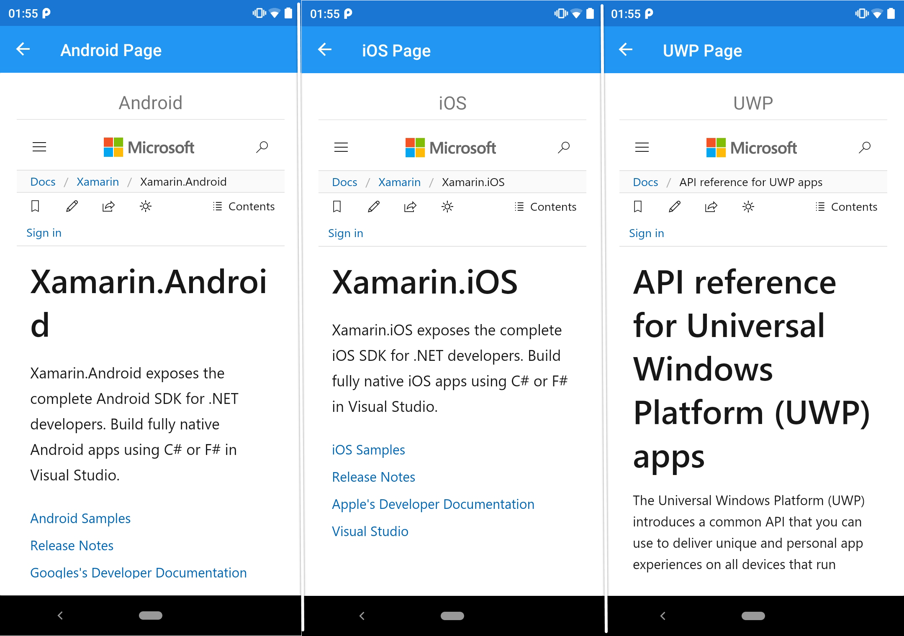

Displaying alerts
===================
You could have noticed that we have a "CheckBox" in our ListView's ItemTemplate and it alters the Foreground color of the Label along with it when it is toggled. However, we have not done anything extra on this and visually this does not make any sense. 

So, let's get that working property. The idea is to restrict the navigation whenever the ListView item is unchecked. Let's throw a display alert whenever we try to navigate by tapping an item when the CheckBox is unchecked. 

For that, first let us configure the DialogService to our application. Open the "ViewModelBase.cs" file and add the below code of creating a property for DialogService and a constructor to inject the dialog service to the ViewModels. Ensure to add the namespace "using Prism.Services" at the top.

```c#
protected IPageDialogService DialogService { get; private set; }

public ViewModelBase(INavigationService navigationService, IPageDialogService pageDialogService)
{
    NavigationService = navigationService;
    DialogService = pageDialogService;
}
```

Open the "MainPageViewModel.cs" and configure the below code in the "OnNavigateToPlatform" method. 

```c#
//Change the constructor code as below to inject the PageDialogService as well.
public MainPageViewModel(INavigationService navigationService, IPageDialogService pageDialogService) : base(navigationService, pageDialogService)
{
    Title = "Main Page";
    NavigateToPlatformCommand = new DelegateCommand<PlatformInfo>(OnNavigateToPlatform);
}

private async void OnNavigateToPlatform(PlatformInfo platformInfo)
{
    var parameter = new NavigationParameters();
    parameter.Add("platformInfo", platformInfo);
    //Display alert when an item is tapped with the Checkbox in it unchecked.
    if(!platformInfo.IsChecked)
    {
        await DialogService.DisplayAlertAsync("Warning...", "Please ensure to check the platform before you navigate.", "OK");
        return;
    }
    await NavigationService.NavigateAsync(platformInfo.PlatformName + "Page", parameter);
}
```

Run the sample and tap the UWP item from the list. Notice the below output. 

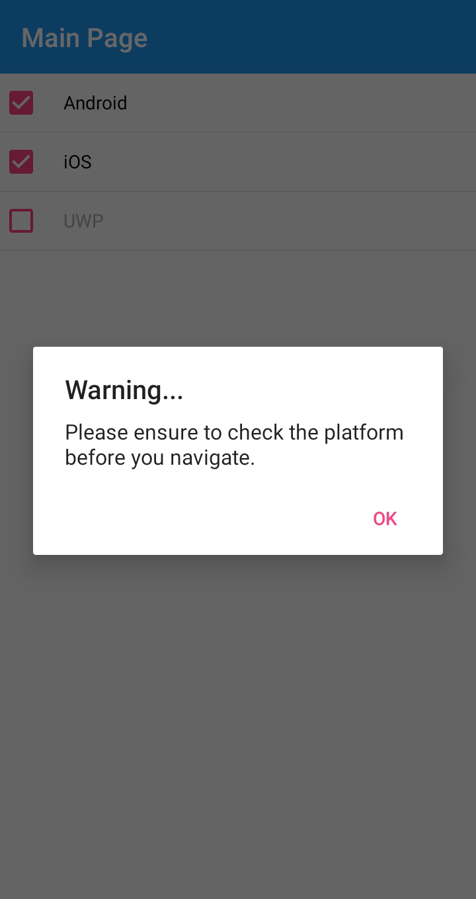

Deep Linking
=============

Let's create out own navigation stack of pages by directly navigating to the UWPPage with AndroidPage and iOSPage in the stack. 

Open the "MainPageViewModel.cs" and configure the below code in the "OnNavigateToPlatform" method. 

```c#
private async void OnNavigateToPlatform(PlatformInfo platformInfo)
{
    var parameter = new NavigationParameters();
    parameter.Add("platformInfo", platformInfo);
    //Display alert when an item is tapped with the Checkbox in it unchecked.
    if(!platformInfo.IsChecked)
    {
        //Deep Linking to navigate multiple page at once.
        await NavigationService.NavigateAsync("AndroidPage/iOSPage/UWPPage", parameter);
        return;
    }
    await NavigationService.NavigateAsync(platformInfo.PlatformName + "Page", parameter);
}
```

Run the sample and tap the UWP item from the list, then click back button thrice. Notice the below output. 


Author
======

Harikrishnan